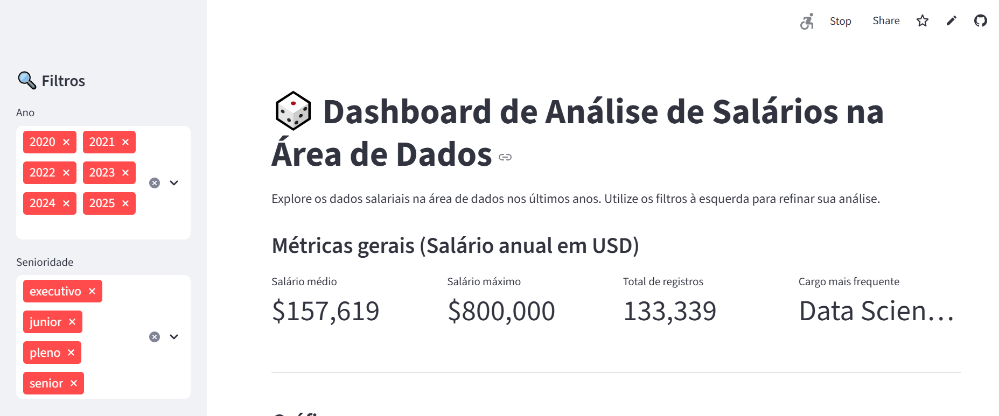

<h1 align="center"> Projeto de dados Alura </h1>

  

---

## 📋 Introdução ao Projeto

**Dashboard de análise de salários na area de dados** é uma solução desenvolvida utilizando uma base de dados do excel e desenvolvendo uma interface no Streamlit.

Através de uma **interface intuitiva e interativa**, o projeto facilita a consulta de informações de salários na área de dados como:

- Engenheiro de dados
- Ciêntista de dados
- AWS
-E etc...

Esses dados são **atualizados** em planilhas de controle,

O objetivo principal foi *Aprender a desenvolver Dashboard usando Python* 

---

## 🚀 Objetivos do Projeto

- **Automatizar** consultas no sistema RISK via terminal Telnet.
- **Extrair** dados de produção de forma rápida e segura.
- **Atualizar** automaticamente planilhas de controle (Excel).
- **Fornecer** uma interface gráfica amigável e acessível.
- **Reduzir** a incidência de erros manuais e aumentar a produtividade.

---

## 🎯 Principais Benefícios

✅ Automatização das consultas no sistema RISK  
✅ Extração rápida e segura de informações críticas  
✅ Atualização automática e dinâmica das planilhas de controle  
✅ Interface gráfica amigável para o usuário final  
✅ Redução de erros e ganho expressivo de produtividade  
✅ Solução robusta, flexível e fácil de operar

---

## 🛠️ Tecnologias Utilizadas

- **Python** (Automação, Interface Gráfica)
- **Tkinter** (Desenvolvimento da GUI)
- **Telnetlib** (Comunicação com o sistema RISK)
- **Pandas** (Manipulação de dados em Excel)
- **Openpyxl** (Leitura e escrita em arquivos .xlsx)
- **Firebase*** (Banco de dados para login de usuários)

---

## 💡 Próximos Passos

- Fase de testes
- Linkar com o Id das janelas
- Aumento na velocidade de extração
- Integração com IA
  
---

> **Nota:** Este projeto foi desenvolvido para modernizar e facilitar o dia a dia do planejamento do Tarugo, unindo **eficiência**, **inovação** e **praticidade** em uma única ferramenta.

---

## 🛠️ Fluxograma do projeto

